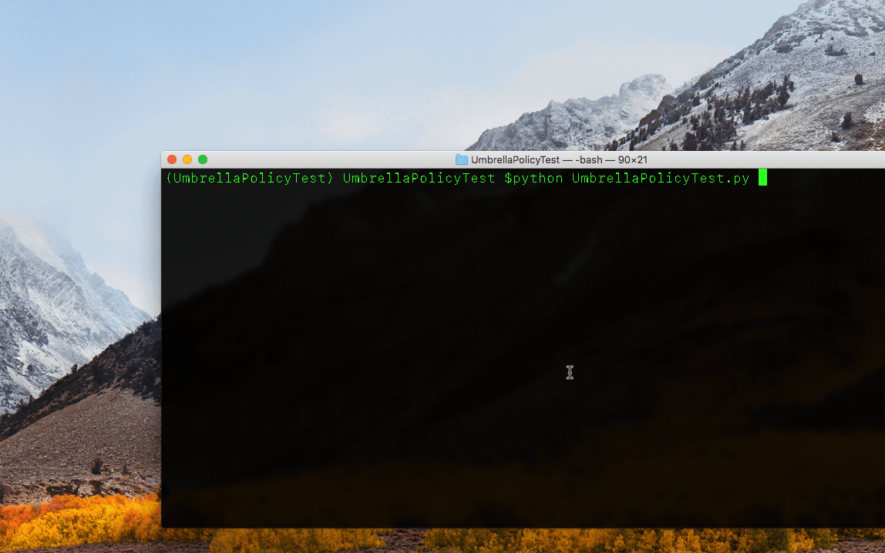

# Umbrella Policy Test
Python 3.5+ script to quickly test if various Cisco Umbrella settings/policies are enabled.

## Background/About
To support a PoC, I needed a way to quickly test all of the test pages that Cisco Umbrella uses to test various policy configurations ([see this URL for a full list](https://support.umbrella.com/hc/en-us/articles/115000411528-What-are-the-Umbrella-Test-Destinations-)).  Basically, as policy was changed/added/removed, I needed a way to test if a virtual endpoint was getting to Umbrella test pages (policy pass or fail).  

The script is simple and uses [Splinter](https://splinter.readthedocs.io/en/latest/) and the chrome web driver as I had similar code from another project.  (I may re-write using pyppeteer and/or requests to remove the browser dependency)  

Basically UmbrellaTestPolicy.py loops through all the URLs in a CSV file, opens an automated chrome web driver session, and then looks for text on the page for both "Pass" and "Fail" for each individual test - "PassedText" indicates that the text in the column with the same name was found.

<p align="center">
  
</p>


## Installation
Script was tested/written on Python 3.7 but should work on 3.5+.  It requires the following external Python modules:
* splinter (and related dependencies)

Preferred method of installation is in a Python virtual environment.

**1. Clone this repo**
```
git clone https://github.com/zabrewer/UmbrellaPolicyTest
```

**2. Make a new virtual environment in the local folder**
```
python3 -m venv UmbrellaPolicyTest
```
(generic command structure is):
python3 -m venv /path/to/new/virtual/environment


**3. activate the virtual environment:**

example location for virtual environment activation script:
mac/linux:
/path/to/env/bin/activate

windows:
C:\path\to\env\Scripts\activate.bat

actual commands to activate UmbrellaPolicyTest virtual environment:
mac/linux:
```
cd UmbrellaPolicyTest
source bin/activate
```

windows (virtualenv creates an activate.bat file in the Scripts subfolder of the virtual environment dir):
```
cd UmbrellaPolicyTest
Scripts\activate.bat
```
If completed successfully, your command prompt should now have changed (begins with the virtual environment name in parentheses)

i.e.
```
(UmbrellaPolicyTest) $
```

To exit the virtual environment at any time, use the deactivate command
```
deactivate
```

## Install Dependencies

```
pip install splinter
```

OR 

```
pip install -r requirements.txt 

```

## Install Chromium
You will need the Chrome webdriver as per the instructions here (per OS instructions):
https://splinter.readthedocs.io/en/latest/drivers/chrome.html

## Usage
1) Change any of the script variables as you see fit:
```
# time in seconds to sleep between page visits
sleeptime = 5   
# ToDo csv file as CLI argument with default of umbrella_urls.csv
csv_filename = 'umbrella_urls.csv'
# debug mode? True/False
debug = False
# headless browser?  True/False
headless = False
```
2) adjust the "umbrella_urls.csv" file if you don't want to run all tests.  You can also change the text to search for invidually for each test (pass/fail).  This may be necessary if you have customized the block pages in your Umbrella policy (non-default block pages).

3) While the virtual environment is active, simply run
```
python UmbrellaPolicyTest.py
```

This project is licensed to you under the terms of the [Cisco Sample
Code License](./LICENSE).

